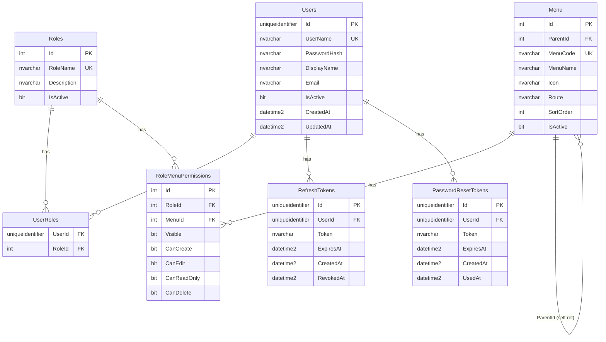

# Implementation Plan: Auth System + Role-Based Menu Permissions

ระบบ Authentication & Authorization สำหรับ `imp-api` โดยใช้ต้นแบบจาก `_phototype/next_api`
รองรับ Login, Register, Remember Me, Reset Password, Change Password
พร้อมระบบกำหนดสิทธิ์การใช้งานตามเมนู (Role-Based Access Control)

---

## Notes

> **Database Schema**: ใช้ **schema `imp`** บน `IMP_DB` — ตาราง: `imp.Users`, `imp.Roles`, `imp.Menu` ฯลฯ

> **Permission Model**: แต่ละ Role x Menu มีสิทธิ์ 5 แบบ: `Visible`, `CanCreate`, `CanEdit`, `CanReadOnly`, `CanDelete`

> **SMTP Config**: ส่วน Email (MailKit) ต้องกรอก SMTP config ใน `appsettings.json` — ถ้ายังไม่มี SMTP server จะ skip ส่งอีเมลจริง (log แทน)

---

## Phase 1: Database Schema

Database: `IMP_DB` | Schema: `imp` | Server: `192.168.10.131\KPIDATAWH`

### ER Diagram



### Tables

#### 1. imp.Users — ผู้ใช้งาน

| Column       | Type                 | Constraint                        |
|--------------|----------------------|-----------------------------------|
| Id           | UNIQUEIDENTIFIER     | PK, DEFAULT NEWSEQUENTIALID()     |
| UserName     | NVARCHAR(256)        | UNIQUE, NOT NULL                  |
| PasswordHash | NVARCHAR(512)        | NOT NULL                          |
| DisplayName  | NVARCHAR(100)        | NOT NULL                          |
| Email        | NVARCHAR(256)        | NULL                              |
| IsActive     | BIT                  | DEFAULT 1                         |
| CreatedAt    | DATETIME2            | DEFAULT SYSUTCDATETIME()          |
| UpdatedAt    | DATETIME2            | DEFAULT SYSUTCDATETIME()          |

**Indexes:**
- UNIQUE on `UserName`
- IX_Users_UserName (includes PasswordHash, DisplayName, IsActive)

#### 2. imp.Roles — บทบาท

| Column      | Type            | Constraint                    |
|-------------|-----------------|-------------------------------|
| Id          | INT IDENTITY    | PK                            |
| RoleName    | NVARCHAR(100)   | UNIQUE, NOT NULL              |
| Description | NVARCHAR(256)   | NULL                          |
| IsActive    | BIT             | DEFAULT 1                     |

#### 3. imp.UserRoles — ผู้ใช้ ↔ บทบาท (M:N)

| Column | Type             | Constraint                    |
|--------|------------------|-------------------------------|
| UserId | UNIQUEIDENTIFIER | FK → Users (CASCADE), PK      |
| RoleId | INT              | FK → Roles (CASCADE), PK      |

#### 4. imp.Menu — เมนู / หน้าในระบบ

| Column    | Type         | Constraint                          |
|-----------|--------------|-------------------------------------|
| Id        | INT IDENTITY | PK                                  |
| MenuCode  | NVARCHAR(50) | UNIQUE, NOT NULL                    |
| MenuName  | NVARCHAR(100)| NOT NULL (ชื่อภาษาไทย)              |
| ParentId  | INT          | FK → self, NULL (เมนูลำดับชั้น)     |
| Route     | NVARCHAR(256)| NULL (frontend route path)          |
| Icon      | NVARCHAR(50) | NULL (lucide icon name)             |
| SortOrder | INT          | DEFAULT 0                           |
| IsActive  | BIT          | DEFAULT 1                           |

#### 5. imp.RoleMenuPermissions — สิทธิ์ตามบทบาท ↔ เมนู

| Column      | Type             | Constraint                      |
|-------------|------------------|---------------------------------|
| Id          | INT IDENTITY     | PK                              |
| RoleId      | INT              | FK → Roles                      |
| MenuId      | INT              | FK → Menu                       |
| Visible     | BIT              | DEFAULT 0 — มองเห็นเมนู         |
| CanCreate   | BIT              | DEFAULT 0 — สร้างข้อมูลได้       |
| CanEdit     | BIT              | DEFAULT 0 — แก้ไขได้             |
| CanReadOnly | BIT              | DEFAULT 1 — ดูอย่างเดียว         |
| CanDelete   | BIT              | DEFAULT 0 — ลบได้                |
| UNIQUE      |                  | (RoleId, MenuId)                |

#### 6. imp.RefreshTokens

| Column    | Type             | Constraint                        |
|-----------|------------------|-----------------------------------|
| Id        | UNIQUEIDENTIFIER | PK, DEFAULT NEWSEQUENTIALID()     |
| UserId    | UNIQUEIDENTIFIER | FK → Users (CASCADE)              |
| Token     | NVARCHAR(512)    | NOT NULL                          |
| ExpiresAt | DATETIME2        | NOT NULL                          |
| CreatedAt | DATETIME2        | DEFAULT SYSUTCDATETIME()          |
| RevokedAt | DATETIME2        | NULL                              |

**Indexes:**
- IX_RefreshTokens_Token (includes UserId, ExpiresAt, RevokedAt)
- IX_RefreshTokens_ExpiresAt (filtered: WHERE RevokedAt IS NULL)

#### 7. imp.PasswordResetTokens

| Column    | Type             | Constraint                        |
|-----------|------------------|-----------------------------------|
| Id        | UNIQUEIDENTIFIER | PK, DEFAULT NEWSEQUENTIALID()     |
| UserId    | UNIQUEIDENTIFIER | FK → Users (CASCADE)              |
| Token     | NVARCHAR(256)    | NOT NULL                          |
| ExpiresAt | DATETIME2        | NOT NULL                          |
| CreatedAt | DATETIME2        | DEFAULT SYSUTCDATETIME()          |
| UsedAt    | DATETIME2        | NULL                              |

**Indexes:**
- IX_PasswordResetTokens_Token (includes UserId, ExpiresAt, UsedAt)

### SQL Scripts

| File | Description |
|------|-------------|
| `SqlScripts/001_CreateSchema.sql` | สร้าง schema `imp` |
| `SqlScripts/002_CreateAuthTables.sql` | สร้าง 7 ตาราง + indexes |
| `SqlScripts/003_SeedData.sql` | Seed: Role Admin + default menus + permissions + admin user |

---

## Phase 2: NuGet Packages

เพิ่มใน `imp-api.csproj`:

| Package | Version | Purpose |
|---------|---------|---------|
| BCrypt.Net-Next | 4.1.0 | Password hashing (work factor 12) |
| Microsoft.AspNetCore.Authentication.JwtBearer | 10.0.3 | JWT authentication middleware |
| System.IdentityModel.Tokens.Jwt | 8.16.0 | JWT token generation |
| MailKit | 4.15.0 | Email sending (password reset) |

---

## Phase 3: Project Structure

```
imp-api/
├── Controllers/
│   ├── AuthController.cs          — Login, Register, Refresh, Logout,
│   │                                ForgotPassword, ResetPassword, ChangePassword
│   ├── MenuController.cs          — Get menus + permissions ของ current user
│   └── AdminController.cs         — [Authorize(Roles="Admin")] จัดการ users/roles/menus/permissions
│
├── Services/
│   ├── IAuthService.cs / AuthService.cs       — Auth business logic
│   ├── IJwtService.cs / JwtService.cs         — Generate/validate JWT
│   ├── IEmailService.cs / EmailService.cs     — Send reset email (MailKit)
│   └── IAdminService.cs / AdminService.cs     — Admin management logic
│
├── Repositories/
│   ├── IUserRepository.cs / UserRepository.cs
│   ├── IRoleRepository.cs / RoleRepository.cs
│   ├── IMenuRepository.cs / MenuRepository.cs
│   ├── IRoleMenuPermissionRepository.cs / RoleMenuPermissionRepository.cs
│   ├── IRefreshTokenRepository.cs / RefreshTokenRepository.cs
│   └── IPasswordResetRepository.cs / PasswordResetRepository.cs
│
├── Models/
│   ├── User.cs
│   ├── Role.cs
│   ├── UserRole.cs
│   ├── Menu.cs
│   ├── RoleMenuPermission.cs
│   ├── RefreshToken.cs
│   └── PasswordResetToken.cs
│
├── DTOs/
│   ├── Auth/
│   │   ├── LoginRequest.cs            — UserName, Password, RememberMe
│   │   ├── RegisterRequest.cs         — UserName, Password, ConfirmPassword, DisplayName, Email
│   │   ├── AuthResponse.cs            — AccessToken, RefreshToken, ExpiresIn, User, Menus+Permissions
│   │   ├── RefreshRequest.cs          — RefreshToken
│   │   ├── LogoutRequest.cs           — RefreshToken
│   │   ├── ForgotPasswordRequest.cs   — UserName
│   │   ├── ResetPasswordRequest.cs    — Token, Password, ConfirmPassword
│   │   ├── ChangePasswordRequest.cs   — CurrentPassword, NewPassword, ConfirmPassword
│   │   ├── ErrorResponse.cs           — Error, Message, FieldErrors
│   │   └── MessageResponse.cs         — Message
│   │
│   └── Admin/
│       ├── CreateUserRequest.cs       — UserName, Password, DisplayName, Email, RoleIds
│       ├── UpdateUserRequest.cs       — DisplayName, Email, IsActive
│       ├── AssignRoleRequest.cs       — RoleIds[]
│       ├── CreateRoleRequest.cs       — RoleName, Description
│       ├── UpdateRoleRequest.cs       — RoleName, Description, IsActive
│       ├── SetMenuPermissionRequest.cs — MenuId, Visible, CanCreate, CanEdit, CanReadOnly, CanDelete
│       ├── UserListResponse.cs        — Users[] with roles
│       ├── RoleListResponse.cs        — Roles[] with permissions
│       └── MenuPermissionResponse.cs  — Menus[] with permissions per role
│
├── Helpers/
│   └── PasswordHasher.cs             — BCrypt hash/verify (workFactor: 12)
│
└── SqlScripts/
    ├── 001_CreateSchema.sql
    ├── 002_CreateAuthTables.sql
    └── 003_SeedData.sql
```

---

## Phase 4: API Endpoints

### AuthController — Public / Authenticated

| Method | Endpoint                    | Auth   | Description                         |
|--------|-----------------------------|--------|-------------------------------------|
| POST   | `api/auth/login`            | Public | เข้าสู่ระบบ (รองรับ RememberMe)      |
| POST   | `api/auth/register`         | Public | สมัครสมาชิก                          |
| POST   | `api/auth/refresh`          | Public | ต่ออายุ token (rotation)             |
| POST   | `api/auth/logout`           | Auth   | ออกจากระบบ (revoke refresh token)    |
| POST   | `api/auth/forgot-password`  | Public | ขอ reset password (ส่ง email)        |
| POST   | `api/auth/reset-password`   | Public | ตั้งรหัสผ่านใหม่ด้วย token            |
| POST   | `api/auth/change-password`  | Auth   | เปลี่ยนรหัสผ่าน (ต้องใส่รหัสเดิม)     |
| GET    | `api/auth/me`               | Auth   | ข้อมูล current user + roles          |

### MenuController — Authenticated

| Method | Endpoint    | Auth | Description                              |
|--------|-------------|------|------------------------------------------|
| GET    | `api/menu`  | Auth | Get menus + permissions ของ current user  |

### AdminController — Admin Only `[Authorize(Roles = "Admin")]`

| Method | Endpoint                              | Description              |
|--------|---------------------------------------|--------------------------|
| GET    | `api/admin/users`                     | รายการ users ทั้งหมด       |
| POST   | `api/admin/users`                     | สร้าง user ใหม่            |
| PUT    | `api/admin/users/{id}`                | แก้ไข user                |
| PUT    | `api/admin/users/{id}/toggle-active`  | เปิด/ปิดการใช้งาน user     |
| POST   | `api/admin/users/{id}/roles`          | กำหนด roles ให้ user       |
| GET    | `api/admin/roles`                     | รายการ roles ทั้งหมด       |
| POST   | `api/admin/roles`                     | สร้าง role ใหม่            |
| PUT    | `api/admin/roles/{id}`                | แก้ไข role                |
| GET    | `api/admin/roles/{id}/permissions`    | ดู permissions ของ role    |
| PUT    | `api/admin/roles/{id}/permissions`    | กำหนด permissions (batch)  |
| GET    | `api/admin/menus`                     | รายการ menus ทั้งหมด (tree) |
| POST   | `api/admin/menus`                     | สร้าง menu ใหม่            |
| PUT    | `api/admin/menus/{id}`                | แก้ไข menu                |

---

## Phase 5: Authentication & Security

### JWT Configuration

| Setting                      | Value                |
|------------------------------|----------------------|
| Algorithm                    | HMAC-SHA256          |
| AccessToken Expiration       | 15 นาที              |
| RefreshToken (Remember=false) | 7 วัน               |
| RefreshToken (Remember=true)  | 30 วัน              |
| Issuer                       | imp-api              |
| Audience                     | imp-app              |

### JWT Claims

| Claim         | Value              |
|---------------|-------------------|
| `sub`         | User.Id            |
| `userName`    | User.UserName      |
| `displayName` | User.DisplayName   |
| `roles`       | User.Roles[] (CSV) |
| `jti`         | Unique token ID    |

### Security Features (จาก Prototype)

- **Password Hashing**: BCrypt with work factor 12
- **Refresh Token Rotation**: revoke token เก่าทุกครั้งที่ refresh
- **Password Reset Token**: GUID-based, 1 ชั่วโมง, ใช้ได้ครั้งเดียว
- **On Password Change/Reset**: revoke ทั้ง refresh tokens และ reset tokens ทั้งหมดของ user
- **Username Enumeration Prevention**: forgot-password ตอบ 200 เสมอ
- **SQL Injection Prevention**: Dapper parameterized queries ทุก query
- **CORS**: อนุญาตเฉพาะ imp-app frontend URL

### appsettings.json — เพิ่ม sections

```json
{
  "Jwt": {
    "SecretKey": "YourSecretKeyAtLeast32Characters!!",
    "Issuer": "imp-api",
    "Audience": "imp-app",
    "AccessTokenExpirationMinutes": 15,
    "RefreshTokenExpirationDays": 7,
    "RememberMeRefreshTokenExpirationDays": 30
  },
  "ResetPassword": {
    "TokenExpirationHours": 1,
    "FrontendBaseUrl": "http://localhost:3000"
  },
  "Smtp": {
    "Host": "",
    "Port": 587,
    "UseSsl": true,
    "UserName": "",
    "Password": "",
    "FromEmail": ""
  }
}
```

---

## Phase 6: Program.cs Changes

เพิ่มใน `Program.cs`:

1. JWT Authentication middleware configuration
2. CORS policy (allow imp-app `localhost:3000`)
3. Custom validation error format (return 422 with ErrorResponse)
4. Global exception handler (return 500 with ErrorResponse)
5. DI registration — ทุก Repository + Service
6. `app.UseAuthentication()` + `app.UseAuthorization()`

---

## Phase 7: Seed Data

```
Role:  Admin (full access ทุกเมนู — Visible, CanCreate, CanEdit, CanDelete = true, CanReadOnly = false)
Role:  User  (ตามที่ Admin กำหนด)
User:  admin / P@ssw0rd (role = Admin)
```

---

## Phase 8: Configuration Changes

### [MODIFY] imp-api.csproj
เพิ่ม 4 NuGet packages (ดู Phase 2)

### [MODIFY] Program.cs
เพิ่ม JWT, CORS, DI, Error handling (ดู Phase 6)

### [MODIFY] appsettings.json
เพิ่ม Jwt, ResetPassword, Smtp sections (ดู Phase 5)

### [OVERWRITE] imp-api.http
HTTP test file สำหรับทดสอบทุก endpoint

---

## Implementation Order

```
Step 1 → สร้าง SQL Scripts (schema + tables + indexes + seed)
Step 2 → เพิ่ม NuGet packages ใน csproj
Step 3 → สร้าง Models (7 ไฟล์)
Step 4 → สร้าง Helpers (PasswordHasher)
Step 5 → สร้าง DTOs (Auth + Admin)
Step 6 → สร้าง Repositories (6 คู่ interface + implementation)
Step 7 → สร้าง Services (4 คู่ interface + implementation)
Step 8 → แก้ไข appsettings.json (เพิ่ม Jwt, ResetPassword, Smtp)
Step 9 → แก้ไข Program.cs (JWT, CORS, DI, Error handling)
Step 10 → สร้าง Controllers (AuthController, MenuController, AdminController)
Step 11 → สร้าง imp-api.http (test file)
Step 12 → dotnet build + ทดสอบผ่าน Swagger
```

---

## Verification Plan

### Build Check

```bash
cd _sorcecode/imp-api
dotnet build
```

### API Testing (imp-api.http)

ทดสอบ flow ตามลำดับ:
1. Register user ใหม่
2. Login ด้วย user ที่สร้าง
3. Login ด้วย admin/P@ssw0rd
4. GET /api/auth/me — ตรวจ user info + roles
5. GET /api/menu — ตรวจ menus + permissions
6. Refresh token
7. Change password
8. Forgot password → Reset password
9. Logout
10. Admin: CRUD users, roles, menus, permissions

### Swagger UI

เปิด `http://localhost:5209/swagger` ตรวจสอบว่า endpoints ทั้งหมดแสดงถูกต้อง

### Manual Steps (ต้องทำก่อน test)

1. Run SQL scripts `001` → `002` → `003` บน `IMP_DB`
2. `dotnet run` แล้วทดสอบ Login ด้วย admin/P@ssw0rd ผ่าน Swagger

---

## Reference

- Prototype source: `_phototype/next_api/`
- Target project: `_sorcecode/imp-api/`
- Database: `IMP_DB` at `192.168.10.131\KPIDATAWH`
- Frontend: `_sorcecode/imp-app/` (Next.js 16, port 3000)
